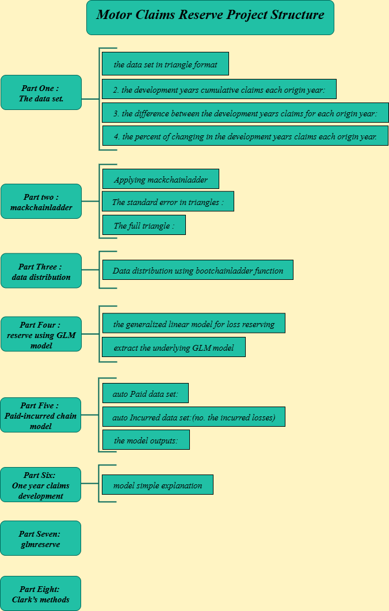

# *Motor_Claims-Reserve-Using_R*


## *How to run ?*

*Clone the repository:*

```bash
https://github.com/omars1234/Motor_Claims-Reserve-Using_R.git
```


## *Project Structure :*



==========


* *To access the project online on Rpubs Web ,Click on the below link*

  [*Motor_Claims Reserve-http://rpubs.com/omars/1008930*](http://rpubs.com/omars/1008930)